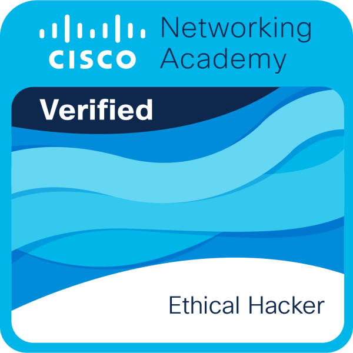

# 🏆 Certifications & Professional Credentials

This repository documents my verified certifications, security training, and professional development aligned with my work in **Cybersecurity, Application Security, and Full-Stack Engineering**.

---

## 🛡️ Ethical Hacking & Cybersecurity (Cisco Networking Academy)

### 📜 Core Certification
- 🎓 [Cisco Ethical Hacker Certificate](./EH/EH%20cert%20cisco.pdf)

---

### 🏅 Skill Badges (Ethical Hacker Path)

#### 🔥 Ethical Hacker — Primary Certification Badge

  

---

#### ⚡ Specialized Skill Modules

<table>
  <tr>
    <td align="center">
      <b>Introduction to Ethical Hacking</b> 
      
    </td>
    <td align="center">
      <b>Planning & Scoping a Pentest</b> 
      
    </td>
  </tr>
  <tr>
    <td align="center">
      <b>Information Gathering & Scanning</b> 
      
    </td>
    <td align="center">
      <b>Social Engineering Attacks</b> 
      
    </td>
  </tr>
  <tr>
    <td align="center">
      <b>Application Vulnerability Exploitation</b> 
      
    </td>
    <td align="center">
      <b>Network Exploitation (Wired/Wireless)</b> 
      
    </td>
  </tr>
  <tr>
    <td align="center">
      <b>Post-Exploitation Techniques</b> 
      
    </td>
    <td align="center">
      <b>Reporting & Communication</b> 
      
    </td>
  </tr>
  <tr>
    <td align="center">
      <b>Tools & Code Analysis</b> 
      
    </td>
    <td align="center">
      <b>Cloud, Mobile & IoT Security</b> 
      
    </td>
  </tr>
</table>

---

## 🌐 Cybersecurity Job Simulations (Forage)

These simulations reflect applied **SOC workflows, phishing analysis, and IAM strategy design** aligned with real enterprise scenarios.

- 🏢 [Deloitte Cybersecurity Simulation](./CS%20virtual%20jobs%20cert/Delitte%20CS%20VJ.pdf)  
- 💳 [Mastercard Cybersecurity Simulation](./CS%20virtual%20jobs%20cert/mastercard%20CS%20VJ.pdf)  
- 🏦 [Tata (TCS) Cybersecurity Analyst Simulation](./CS%20virtual%20jobs%20cert/tata%20CS%20VJ.pdf)

---

## 🏢 Internship & Training Certifications

  
  

- Cyber Security Internship — Acmegrade (2024)  
- Cyber Security Fundamentals Training — Acmegrade  

---

## ☁️ AI & Cloud Certifications

### Prompt Engineering & AI Systems

  

- 🧠 Prompt Design in Vertex AI — Google Cloud (2025)

---

## 💻 Development & Technical Certifications

- ⚙️ [Build CRUD API with FastAPI](./Build%20curd%20API%20with%20fastapi.pdf)  
- 🌦️ [Build Weather App (API + JavaScript)](./Build%20weatherapp%20with%20api%20and%20JS.pdf)  
- 🤖 [N8N Workflow Automation](./N8N%20crash%20course.pdf)  
- 🐍 [Python Bootcamp — LetsUpgrade](./python%20bootcamp%20from%20letsupgrade.pdf)  
- 🎓 [Python Spoken Tutorial — IIT Bombay](./Python%20Spoken%20Tutorial%20-%20IIT%20Bombay.pdf)

---

## 🏆 Additional Achievements

- 🥇 [NeoFuture Hackathon Recognition](./Hackethon%20NeoFuture.pdf)  
- 🎨 [Canva Design Specialization](./canva%20design%20from%20letsupgrade.pdf)

---

## 📌 Notes

- These certifications complement hands-on work including:
  - Vulnerability Scanner (Flask + Nmap + SQLMap)
  - OSINT Automation (ReconXplorer)
  - AI Threat Intelligence Platform (ThreatShieldAI)
- Full project implementations and architecture details are available on my GitHub profile.

---

## 🔗 Connect

- 💼 LinkedIn: https://linkedin.com/in/gourab-ghosh-zecuron  
- 💻 GitHub: https://github.com/gourab-0  
- 📧 Email: gourabghosh828@gmail.com  
